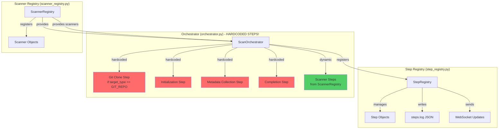
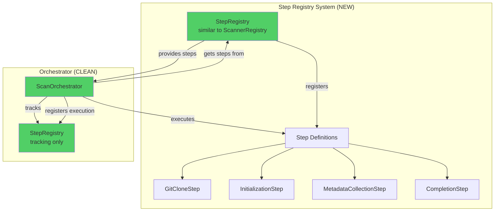

# Step Registry Architecture - Current State & Problems

## Current Architecture (PROBLEMATIC)



## Problems

### 1. **Hardcoded Steps in Orchestrator**
- `Git Clone` - hardcoded in `_pre_register_all_steps()` and `_run_git_clone()` with `if self.target_type == TargetType.GIT_REPO`
- `Initialization` - hardcoded in `_pre_register_all_steps()` and `run_scan()`
- `Metadata Collection` - hardcoded in `_pre_register_all_steps()` and `_collect_metadata()`
- `Completion` - hardcoded in `_pre_register_all_steps()` and `run_scan()`

### 2. **No Step Registry System**
- Steps are NOT defined in a registry (like ScannerRegistry)
- Steps are hardcoded in Orchestrator logic
- Cannot dynamically add/remove steps
- Cannot reuse steps across different orchestrators

### 3. **Mixed Concerns**
- Orchestrator mixes:
  - Step definition (what steps exist)
  - Step execution (how to run steps)
  - Step tracking (registering with StepRegistry)

## Where Steps Are Defined

### Current State:
- **Git Clone**: `scanner/core/orchestrator.py` lines 459-500, 594-233
- **Initialization**: `scanner/core/orchestrator.py` lines 516-523, 598-601
- **Metadata Collection**: `scanner/core/orchestrator.py` lines 545-553, 400-449
- **Completion**: `scanner/core/orchestrator.py` lines 559-567, 625-636
- **Scanner Steps**: `scanner/core/scanner_registry.py` (dynamic, clean!)

### Step Registry:
- **File**: `scanner/core/step_registry.py`
- **Purpose**: Only tracks/manages Steps, does NOT define them
- **Methods**: `start_step()`, `complete_step()`, `fail_step()`, `skip_step()`

## ContainerSpec Issue

In `container_spec.py` line 218-219:
```python
# Add git branch if provided (only for git_repo)
if git_branch:
    environment["GIT_BRANCH"] = git_branch
```

**This is OK** - it's just setting an environment variable. The comment is misleading though - it's not checking `target_type`, just setting the env var if provided.

## Solution: Step Registry System

Steps should be defined in a registry (like ScannerRegistry):



## Files Structure

```
scanner/core/
├── step_registry.py          # Step tracking (current - OK)
├── step_definitions.py       # Step definitions (NEW - like ScannerRegistry)
├── steps/
│   ├── __init__.py
│   ├── git_clone_step.py     # GitCloneStep class
│   ├── initialization_step.py # InitializationStep class
│   ├── metadata_step.py       # MetadataCollectionStep class
│   └── completion_step.py     # CompletionStep class
└── orchestrator.py            # Only executes steps, doesn't define them
```
