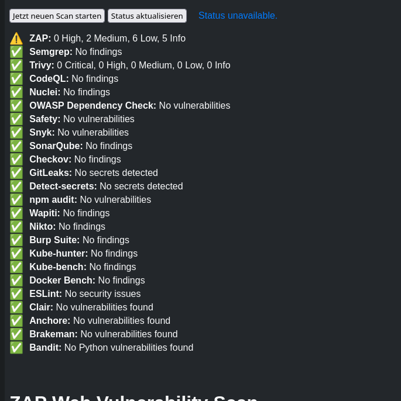
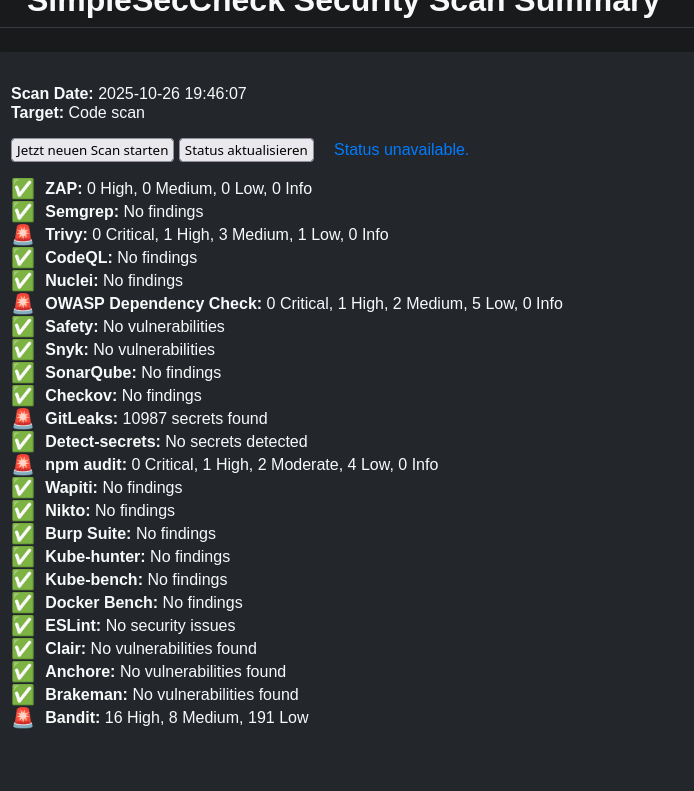
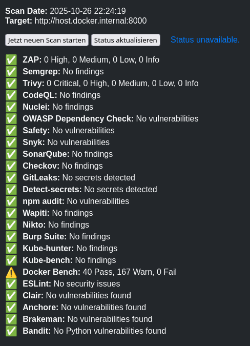

# SimpleSecCheck - Single-Shot Security Scanner

> **One Command, Complete Security Analysis**

SimpleSecCheck is a powerful, single-shot Docker-based security scanner that performs comprehensive analysis of your codebase or web applications. Simply run one command and get detailed security reports with no permanent monitoring or infrastructure required.

---

## ⚖️ Legal Notice

**Important:** SimpleSecCheck performs active security scans. Ensure you have proper authorization before scanning any target.

### 🌍 Europe (GDPR/DSGVO)

**Germany:**
- ✅ Scanning your own systems/domains is legal
- ✅ Authorized targets with written consent (e.g., contracted pen-testing)
- ❌ Unauthorized scanning violates German law (§202a, §202b, §202c StGB - Data Protection Act)

**EU General (GDPR):**
- Requires explicit consent for automated vulnerability scanning
- May involve processing of personal data
- Ensure compliance with GDPR Article 6 (lawful basis for processing)

### 🇺🇸 United States

**Federal Law (CFAA):**
- Unauthorized access to computer systems is illegal (18 U.S.C. § 1030)
- Scanning systems without permission may constitute a felony
- Legal only with explicit written authorization or ownership

**State Variations:**
- Some states have additional cybercrime laws
- Always obtain written authorization before scanning third-party systems

### 🌐 General Best Practices

**Always Legal:**
- ✅ Your own systems/domains
- ✅ Systems you explicitly own or control

**Requires Authorization:**
- ✅ Contracted penetration testing
- ✅ Bug bounty programs (follow program rules)
- ✅ Staging/test environments (verify ownership/authorization)

**Never Scan Without Permission:**
- ❌ Third-party systems without explicit consent
- ❌ Public websites/applications you don't own
- ❌ Systems outside bug bounty scope

**⚠️ Disclaimer:** This tool is for authorized security testing only. Users are responsible for ensuring they have proper authorization before scanning any system. Unauthorized scanning is illegal and may result in criminal prosecution.

---

## 🚀 Features

- **Single-Shot Analysis:** One command, complete security scan
- **Dual Scan Modes:** Code analysis OR web application scanning
- **Comprehensive Code Analysis:** Semgrep + Trivy for vulnerabilities and dependencies
- **Web Application Scanning:** OWASP ZAP for web vulnerabilities
- **Unified Reporting:** Consolidated HTML reports with all findings
- **Zero Infrastructure:** No databases, no persistent services, no monitoring
- **Docker-Based:** Isolated, secure scanning environment
- **Easy Usage:** Simple `./run-docker.sh` command for everything

---

## 🏁 Quick Start

### Prerequisites

- Docker and Docker Compose
- Target codebase or web application to scan

### Easy Usage

```bash
# Clone the repository
git clone https://github.com/fr4iser90/SimpleSecCheck.git
cd SimpleSecCheck

# Make the script executable (one-time setup)
chmod +x run-docker.sh

# Scan a local code project
./run-docker.sh /path/to/your/project

# Scan a website
./run-docker.sh https://example.com
```

That's it! Results will be available in the `results/` directory.

### Scan Examples

#### 🌐 Website/Domain Scanning
Scan any public website or application:
```bash
./run-docker.sh https://example.com
```


#### 💻 Local Codebase Scanning
Scan your local project for security issues:
```bash
./run-docker.sh /path/to/your/project
```


#### 🏠 Local Network Scanning
Scan applications in your local Docker network (e.g., `http://host.docker.internal:8000`):
```bash
./run-docker.sh network
```


### What Gets Scanned

**Code Projects:**
- Static code analysis with Semgrep
- Dependency vulnerabilities with Trivy
- Security rule violations
- Docker daemon compliance with Docker Bench

**Websites:**
- Web application vulnerabilities with OWASP ZAP
- Security misconfigurations
- Common web attacks

---

## ⚙️ Configuration (Optional)

### Environment Variables

Create a `.env` file for custom settings:

```bash
# For web scanning
TARGET_URL=https://your-website.com

# For code scanning (default: auto-detected)
SCAN_TYPE=code
```

### API Tokens (Optional)

Some tools can benefit from API tokens for enhanced functionality:

**Copy the example file and add your tokens:**
```bash
cp env.example .env
nano .env  # Or use your favorite editor
```

**Available API Tokens:**

| Token | Tool | Purpose | Get it from |
|-------|------|---------|-------------|
| `NVD_API_KEY` | OWASP Dependency Check | Higher rate limits for vulnerability database lookups | https://nvd.nist.gov/developers/request-an-api-key |
| `SNYK_TOKEN` | Snyk | Cloud-based vulnerability scanning with Snyk | https://snyk.io/user/api |

**Note:** All API tokens are optional. Tools will work in their basic modes without tokens. Tokens are stored locally in your `.env` file (which is git-ignored) and are never uploaded or shared.

---

## 🔍 Analysis Details

### Code Analysis Tools (26 Integrated Security Tools)
**Static Code Analysis:**
- **Semgrep:** Static code analysis with security-focused rules
- **CodeQL:** Advanced code analysis and vulnerability detection
- **ESLint:** JavaScript/TypeScript security linting
- **Brakeman:** Ruby on Rails security scanning
- **Bandit:** Python security linting

**Dependency & Container Scanning:**
- **Trivy:** Container and dependency vulnerability scanning
- **Clair:** Container image vulnerability analysis
- **Anchore:** Container image security scanning
- **OWASP Dependency Check:** Dependency vulnerability analysis
- **Safety:** Python dependency security checker
- **Snyk:** Dependency and container vulnerability scanner
- **npm audit:** Node.js package vulnerability scanning

**Infrastructure as Code:**
- **Checkov:** Infrastructure security scanning (AWS, Azure, GCP)
- **Terraform Security:** Terraform-specific security checks

**Secret Detection:**
- **TruffleHog:** Secret and credential detection
- **GitLeaks:** Git repository secret scanning
- **Detect-secrets:** Yelp's secret detection tool

**Code Quality:**
- **SonarQube:** Code quality and security analysis

### Web Application Security Tools
- **OWASP ZAP:** Web application vulnerability scanning
- **Nuclei:** Fast web vulnerability scanning with custom templates
- **Wapiti:** Web application security scanner
- **Nikto:** Web server security scanner
- **Burp Suite:** Web application security testing

### Container & Kubernetes Security
- **Kube-hunter:** Kubernetes cluster security scanner
- **Kube-bench:** Kubernetes CIS benchmark compliance testing
- **Docker Bench:** Docker daemon CIS benchmark compliance testing

---

## 📊 Results & Reports

After scanning, results are available in the `results/[project]_[timestamp]/` directory:

- **`security-summary.html`** - Unified HTML report with all findings
- **`semgrep.json`** - Detailed code analysis results (code scans only)
- **`trivy.json`** - Dependency and vulnerability scan results (code scans only)
- **`docker-bench.json`** - Docker daemon compliance results (code scans only)
- **`zap-report.xml`** - Web application vulnerability report (web scans only)
- **`security-check.log`** - Complete scan log

Open the HTML report in your browser for the best experience!

---

## 🛡️ Security Rules

SimpleSecCheck includes comprehensive security rules:

- **Code Bugs** (`rules/code-bugs.yml`) - Common programming errors
- **Secrets Detection** (`rules/secrets.yml`) - API keys, passwords, tokens
- **API Security** (`rules/api-security.yml`) - API vulnerabilities
- **LLM/AI Security** (`rules/llm-ai-security.yml`) - AI-specific vulnerabilities
- **Prompt Injection** (`rules/prompt-injection.yml`) - LLM prompt attacks

---

## 🔧 Advanced Usage

### Custom Rule Sets

Add your own Semgrep rules to the `rules/` directory:

```bash
# Add custom rules
echo "rules:" >> rules/custom.yml
echo "  - id: my-custom-rule" >> rules/custom.yml
echo "    patterns:" >> rules/custom.yml
echo "      - pattern: dangerous_function(...)" >> rules/custom.yml
```

### Direct Docker Compose Usage

For advanced users who want more control:

```bash
# Code scan with custom settings
docker-compose run --rm -v /path/to/code:/target:ro scanner

# Web scan with custom URL
TARGET_URL=https://your-site.com docker-compose run --rm scanner
```

---

## 🚨 Security Considerations

- **Single-Shot Execution:** No persistent services or monitoring
- **Isolated Environment:** Docker containers are destroyed after scanning
- **Read-Only Access:** Target code is mounted read-only
- **No Data Retention:** All scan data is temporary and local
- **Minimal Attack Surface:** No web interfaces or persistent processes

---

## 🤝 Contributing

- Add new security rules to `rules/`
- Extend scanning capabilities in `scripts/tools/`
- Improve report generation in `scripts/`
- Submit issues and feature requests

---

## 📄 License

SimpleSecCheck is Open Source, MIT-licensed.