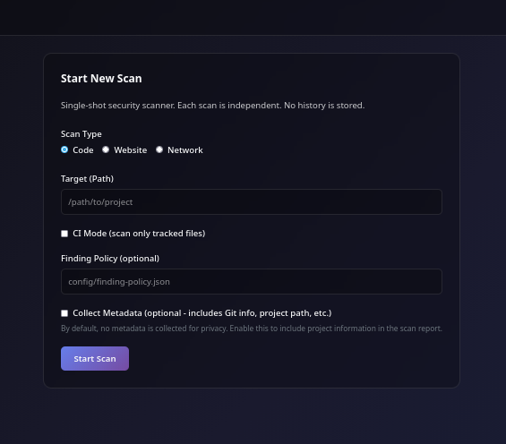
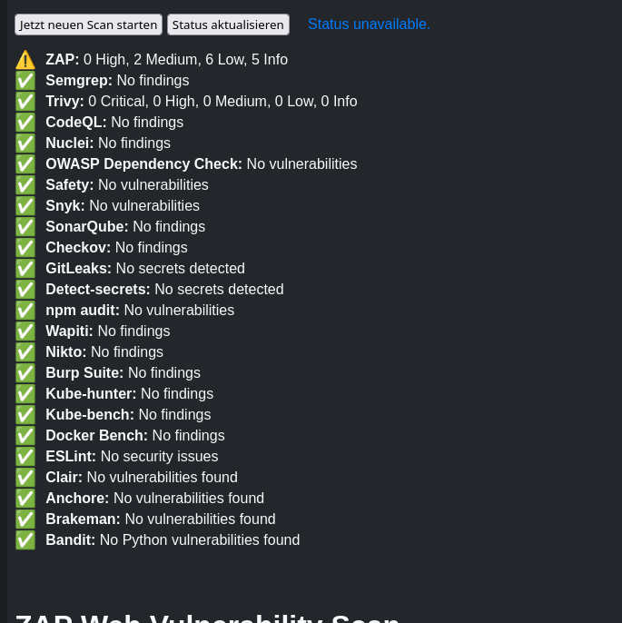
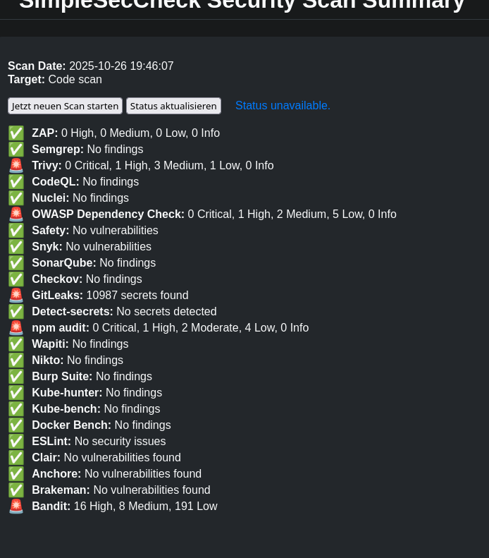
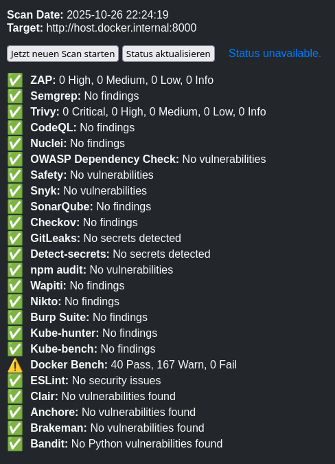

<p align="center">
  
</p>

# SimpleSecCheck - Single-Shot Security Scanner

<div align="center">
  
  <p><strong>One Command, Complete Security Analysis</strong></p>
</div>

SimpleSecCheck is a powerful, single-shot Docker-based security scanner that performs comprehensive analysis of your codebase or web applications. Simply run one command and get detailed security reports with no permanent monitoring or infrastructure required.

---

## ⚖️ Legal Notice

**Important:** SimpleSecCheck performs active security scans. Ensure you have proper authorization before scanning any target.

### 🌍 Europe (GDPR/DSGVO)

**Germany:**
- ✅ Scanning your own systems/domains is legal
- ✅ Authorized targets with written consent (e.g., contracted pen-testing)
- ❌ Unauthorized scanning violates German law (§202a, §202b, §202c StGB - Data Protection Act)

**EU General (GDPR):**
- Requires explicit consent for automated vulnerability scanning
- May involve processing of personal data
- Ensure compliance with GDPR Article 6 (lawful basis for processing)

### 🇺🇸 United States

**Federal Law (CFAA):**
- Unauthorized access to computer systems is illegal (18 U.S.C. § 1030)
- Scanning systems without permission may constitute a felony
- Legal only with explicit written authorization or ownership

**State Variations:**
- Some states have additional cybercrime laws
- Always obtain written authorization before scanning third-party systems

### 🌐 General Best Practices

**Always Legal:**
- ✅ Your own systems/domains
- ✅ Systems you explicitly own or control

**Requires Authorization:**
- ✅ Contracted penetration testing
- ✅ Bug bounty programs (follow program rules)
- ✅ Staging/test environments (verify ownership/authorization)

**Never Scan Without Permission:**
- ❌ Third-party systems without explicit consent
- ❌ Public websites/applications you don't own
- ❌ Systems outside bug bounty scope

**⚠️ Disclaimer:** This tool is for authorized security testing only. Users are responsible for ensuring they have proper authorization before scanning any system. Unauthorized scanning is illegal and may result in criminal prosecution.

---

##  Features

- **Single-Shot Analysis:** One command, complete security scan
- **Dual Scan Modes:** Code analysis OR web application scanning
- **Comprehensive Code Analysis:** Semgrep + Trivy for vulnerabilities and dependencies
- **Web Application Scanning:** OWASP ZAP for web vulnerabilities
- **Unified Reporting:** Consolidated HTML reports with all findings
- **Zero Infrastructure:** No databases, no persistent services, no monitoring
- **Docker-Based:** Isolated, secure scanning environment
- **Easy Usage:** Simple `./scripts/run-docker.sh` command for everything

---

## 🏁 Quick Start

### Prerequisites

- Docker and Docker Compose
- Target codebase or web application to scan

### Easy Usage

```bash
# Clone the repository
git clone https://github.com/fr4iser90/SimpleSecCheck.git
cd SimpleSecCheck

# Make the script executable (one-time setup)
chmod +x scripts/run-docker.sh

# Scan a local code project
./scripts/run-docker.sh /path/to/your/project

# Scan a Git repository (GitHub/GitLab URL) - automatically clones and scans
./scripts/run-docker.sh https://github.com/user/repo

# CI-friendly code scan (tracked files only + noise-reduction defaults)
./scripts/run-docker.sh --ci /path/to/your/project

# Use a project-specific finding policy from target repo
./scripts/run-docker.sh --finding-policy config/finding-policy.json /path/to/your/project

# Scan a website
./scripts/run-docker.sh https://example.com
```

That's it! Results will be available in the `results/` directory.

### 🌐 WebUI (Optional)

SimpleSecCheck includes an optional web interface for a more user-friendly experience:

```bash
# Start WebUI with docker-compose profile
docker-compose --profile webui up

# Access at http://localhost:8080
```



**WebUI Features:**
- ✅ Start scans via web interface
- ✅ **Git Repository Support:** Direct GitHub/GitLab URL input with automatic cloning
- ✅ **Branch Selection:** Automatic branch detection with manual selection option
- ✅ Live progress and logs during scan execution
- ✅ View HTML reports directly in browser
- ✅ Browse local results with file browser
- ✅ Auto-shutdown feature for security (configurable idle timeout)
- ✅ **Automatic Cleanup:** Temporary Git repositories are automatically deleted after scan

**Security Notes:**
- WebUI binds to `127.0.0.1:8080` by default (localhost only)
- For Docker deployments, set `HOST=0.0.0.0` environment variable if needed
- WebUI follows single-shot principle: no database, no persistent state
- Each scan is independent - no history tracking

**WebUI is completely optional** - the CLI (`./scripts/run-docker.sh`) still works as before.

See [webui/README.md](webui/README.md) for more details.

### Using Pre-built Docker Image Directly (Without Wrapper Script)

**Pull and run the pre-built image from Docker Hub:**

```bash
# Pull the latest image
docker pull fr4iser/simpleseccheck:latest

# Scan a local code project
docker run --rm \
  -v /path/to/your/project:/target:ro \
  -v $(pwd)/results:/SimpleSecCheck/results \
  -v $(pwd)/logs:/SimpleSecCheck/logs \
  -v $(pwd)/config:/SimpleSecCheck/config \
  -v $(pwd)/rules:/SimpleSecCheck/rules \
  -v $(pwd)/trivy:/SimpleSecCheck/trivy \
  -v $(pwd)/anchore:/SimpleSecCheck/anchore \
  -v $(pwd)/zap:/SimpleSecCheck/zap \
  -v $(pwd)/owasp-dependency-check-data:/SimpleSecCheck/owasp-dependency-check-data \
  -v /var/run/docker.sock:/var/run/docker.sock \
  -e SCAN_TYPE=code \
  fr4iser/simpleseccheck:latest \
  /SimpleSecCheck/scripts/security-check.sh

# Scan a Git repository (GitHub/GitLab URL)
# Note: Use the wrapper script for Git repository scanning (automatically clones and cleans up)
./scripts/run-docker.sh https://github.com/user/repo

# Scan a website
docker run --rm \
  -e SCAN_TYPE=website \
  -e ZAP_TARGET=https://example.com \
  -v $(pwd)/results:/SimpleSecCheck/results \
  -v $(pwd)/logs:/SimpleSecCheck/logs \
  -v $(pwd)/config:/SimpleSecCheck/config \
  -v $(pwd)/rules:/SimpleSecCheck/rules \
  -v $(pwd)/zap:/SimpleSecCheck/zap \
  fr4iser/simpleseccheck:latest \
  /SimpleSecCheck/scripts/security-check.sh

# Scan local network/Docker infrastructure
docker run --rm \
  -e SCAN_TYPE=network \
  -v $(pwd)/results:/SimpleSecCheck/results \
  -v $(pwd)/logs:/SimpleSecCheck/logs \
  -v $(pwd)/config:/SimpleSecCheck/config \
  -v $(pwd)/rules:/SimpleSecCheck/rules \
  -v /var/run/docker.sock:/var/run/docker.sock:ro \
  fr4iser/simpleseccheck:latest \
  /SimpleSecCheck/scripts/security-check.sh
```

### Scan Examples

#### 🌐 Website/Domain Scanning
Scan any public website or application:
```bash
./scripts/run-docker.sh https://example.com
```


#### 💻 Local Codebase Scanning
Scan your local project for security issues:
```bash
./scripts/run-docker.sh /path/to/your/project
```


#### 🔗 Git Repository Scanning
Scan a Git repository directly from GitHub or GitLab (automatically clones, scans, and cleans up):
```bash
./scripts/run-docker.sh https://github.com/user/repo
./scripts/run-docker.sh https://gitlab.com/user/repo
```

#### 🏠 Local Network Scanning
Scan applications in your local Docker network (e.g., `http://host.docker.internal:8000`):
```bash
./scripts/run-docker.sh network
```


### What Gets Scanned

**Code Projects:**
- Static code analysis with Semgrep (including React Native-specific security rules)
- Dependency vulnerabilities with Trivy
- Security rule violations
- Docker daemon compliance with Docker Bench
- **React Native Support:** Mobile app security patterns including AsyncStorage security, WebView vulnerabilities, deep linking issues, and more

**Websites:**
- Web application vulnerabilities with OWASP ZAP
- Security misconfigurations
- Common web attacks

---

## ⚙️ Configuration (Optional)

### Environment Variables

Create a `.env` file for custom settings:

```bash
# For web scanning
TARGET_URL=https://your-website.com

# For code scanning (default: auto-detected)
SCAN_TYPE=code

# Scan scope for code scans:
# - full (default): scan mounted target path as-is
# - tracked: scan only git-tracked files (recommended for CI to reduce local artifact noise)
SCAN_SCOPE=tracked

# Optional comma-separated exclude paths for code scanners
# (defaults already include common noise directories such as node_modules, dist, build, results, logs)
SIMPLESECCHECK_EXCLUDE_PATHS=.git,node_modules,dist,build,coverage,.next,.cache,results,logs

# Optional policy file for triage (rule severity overrides, accepted findings, dedupe behavior)
FINDING_POLICY_FILE=/SimpleSecCheck/config/policy/finding_policy.json
```

### Finding Policy (False-Positive Tuning)

SimpleSecCheck supports a policy file at `conf/finding_policy.json` to reduce scanner noise without hiding real risks.

- **Rule-level severity overrides:** downgrade noisy checks (e.g. a specific rule/path to `INFO`)
- **Accepted findings with rationale:** keep an auditable reason for accepted risks
- **Duplicate consolidation:** merge near-identical Semgrep findings on adjacent lines

Use this carefully: accepted findings should include clear justifications and periodic revalidation.

Policy resolution order for code scans:
- Explicit CLI arg: `--finding-policy <path>` (recommended for CI)
- Auto-discovery in target repo:
  - `config/finding-policy.json`
  - `security/finding-policy.json`
  - `.security/finding-policy.json`
- Fallback: scanner default `conf/finding_policy.json`

### API Tokens (Optional)

Some tools can benefit from API tokens for enhanced functionality:

**Copy the example file and add your tokens:**
```bash
cp env.example .env
nano .env  # Or use your favorite editor
```

**Available API Tokens:**

| Token | Tool | Purpose | Get it from |
|-------|------|---------|-------------|
| `NVD_API_KEY` | OWASP Dependency Check | Higher rate limits for vulnerability database lookups | https://nvd.nist.gov/developers/request-an-api-key |
| `SNYK_TOKEN` | Snyk | Cloud-based vulnerability scanning with Snyk | https://snyk.io/user/api |

**Note:** All API tokens are optional. Tools will work in their basic modes without tokens. Tokens are stored locally in your `.env` file (which is git-ignored) and are never uploaded or shared.

### Updating OWASP Dependency Check Database

The OWASP Dependency Check vulnerability database is cached locally to avoid re-downloading 300K+ vulnerabilities on every scan. The database is automatically downloaded on the first scan, but you should update it periodically to get the latest vulnerability information.

**When to update:**
- **Weekly:** Recommended for critical projects or production environments
- **Monthly:** Sufficient for most development workflows
- **As needed:** Before important security audits or when new CVEs are announced

**How to update:**

```bash
# Update database (uses public rate limits, slower)
./scripts/update-owasp-db.sh

# Update with NVD API key (faster, recommended)
NVD_API_KEY=your-key ./scripts/update-owasp-db.sh

# Or set NVD_API_KEY in .env file
echo "NVD_API_KEY=your-key" >> .env
./scripts/update-owasp-db.sh
```

**Using Docker directly:**

```bash
docker run --rm \
  -v $(pwd)/owasp-dependency-check-data:/SimpleSecCheck/owasp-dependency-check-data \
  -e NVD_API_KEY=${NVD_API_KEY:-} \
  fr4iser/simpleseccheck:latest \
  dependency-check --updateonly --data /SimpleSecCheck/owasp-dependency-check-data ${NVD_API_KEY:+--nvdApiKey=$NVD_API_KEY}
```

**Note:** The update process typically takes 5-15 minutes depending on your connection speed. Using an `NVD_API_KEY` significantly speeds up the process by increasing rate limits.

---

## 🔍 Analysis Details

### Code Analysis Tools (28 Integrated Security Tools)
**Static Code Analysis:**
- **Semgrep:** Static code analysis with security-focused rules
- **CodeQL:** Advanced code analysis and vulnerability detection
- **ESLint:** JavaScript/TypeScript security linting
- **Brakeman:** Ruby on Rails security scanning
- **Bandit:** Python security linting

**Dependency & Container Scanning:**
- **Trivy:** Container and dependency vulnerability scanning
- **Clair:** Container image vulnerability analysis
- **Anchore:** Container image security scanning
- **OWASP Dependency Check:** Dependency vulnerability analysis
- **Safety:** Python dependency security checker
- **Snyk:** Dependency and container vulnerability scanner
- **npm audit:** Node.js package vulnerability scanning

**Infrastructure as Code:**
- **Checkov:** Infrastructure security scanning (AWS, Azure, GCP)
- **Terraform Security:** Terraform-specific security checks

**Secret Detection:**
- **TruffleHog:** Secret and credential detection
- **GitLeaks:** Git repository secret scanning
- **Detect-secrets:** Yelp's secret detection tool

**Code Quality:**
- **SonarQube:** Code quality and security analysis

**Mobile App Security:**
- **React Native Security:** React Native-specific security rules for AsyncStorage, WebView, deep linking, and more
- **Android Manifest Scanner:** Automatically detects and scans AndroidManifest.xml files for dangerous permissions, cleartext traffic, backup settings, and debug configurations
- **iOS Plist Scanner:** Automatically detects and scans Info.plist files for App Transport Security (ATS) misconfigurations, arbitrary loads, and security settings
- JavaScript/TypeScript scanning works on React Native code
- CodeQL supports Kotlin, Swift, and Objective-C for native mobile code analysis
- npm audit for React Native dependencies

### Web Application Security Tools
- **OWASP ZAP:** Web application vulnerability scanning
- **Nuclei:** Fast web vulnerability scanning with custom templates
- **Wapiti:** Web application security scanner
- **Nikto:** Web server security scanner
- **Burp Suite:** Web application security testing

### Container & Kubernetes Security
- **Kube-hunter:** Kubernetes cluster security scanner
- **Kube-bench:** Kubernetes CIS benchmark compliance testing
- **Docker Bench:** Docker daemon CIS benchmark compliance testing

---

## 📊 Results & Reports

After scanning, results are available in the `results/[project]_[timestamp]/` directory:

- **Code scans:** `results/[ProjectName]_[timestamp]/` (e.g., `SimplePDFEditor_20251028_175751/`)
- **Git repository scans:** `results/[RepoName]_[timestamp]/` (e.g., `PIDEA_20260301_101656/`)
- **Website scans:** `results/[domain]_[timestamp]/`
- **Network scans:** `results/network-infrastructure_[timestamp]/`

**Results files:**
- **`security-summary.html`** - Unified HTML report with all findings
- **`semgrep.json`** - Detailed code analysis results (code scans only)
- **`trivy.json`** - Dependency and vulnerability scan results (code scans only)
- **`docker-bench.json`** - Docker daemon compliance results (network scans only)
- **`zap-report.xml`** - Web application vulnerability report (web scans only)
- **`security-check.log`** - Complete scan log

Open the HTML report in your browser for the best experience!

---

## 🛡️ Security Rules

SimpleSecCheck includes comprehensive security rules:

- **Code Bugs** (`config/rules/code-bugs.yml`) - Common programming errors
- **Secrets Detection** (`config/rules/secrets.yml`) - API keys, passwords, tokens
- **API Security** (`config/rules/api-security.yml`) - API vulnerabilities
- **LLM/AI Security** (`config/rules/llm-ai-security.yml`) - AI-specific vulnerabilities
- **Prompt Injection** (`config/rules/prompt-injection.yml`) - LLM prompt attacks
- **React Native Security** (`config/rules/react-native-security.yml`) - Mobile app security issues (AsyncStorage, WebView, deep linking, etc.)

---

## 🔧 Advanced Usage

### Custom Rule Sets

Add your own Semgrep rules to the `config/rules/` directory:

```bash
# Add custom rules
echo "rules:" >> config/rules/custom.yml
echo "  - id: my-custom-rule" >> config/rules/custom.yml
echo "    patterns:" >> config/rules/custom.yml
echo "      - pattern: dangerous_function(...)" >> config/rules/custom.yml
```

### Direct Docker Compose Usage

For advanced users who want more control:

```bash
# Code scan with custom settings
docker-compose run --rm -v /path/to/code:/target:ro scanner

# Web scan with custom URL
TARGET_URL=https://your-site.com docker-compose run --rm scanner
```

---

## 🚨 Security Considerations

- **Single-Shot Execution:** No persistent services or monitoring
- **Isolated Environment:** Docker containers are destroyed after scanning
- **Read-Only Access:** Target code is mounted read-only
- **No Data Retention:** All scan data is temporary and local
- **Minimal Attack Surface:** No web interfaces or persistent processes

---

## 🤝 Contributing

- Add new security rules to `config/rules/`
- Extend scanning capabilities in `scripts/tools/`
- Improve report generation in `scripts/`
- Submit issues and feature requests

---

## 📄 License

SimpleSecCheck is Open Source, MIT-licensed.

**Third-Party Tools:** This project orchestrates various third-party security tools. Each tool is distributed under its own license. Users are responsible for complying with the respective licenses of all integrated tools. See [THIRD_PARTY_LICENSES.md](THIRD_PARTY_LICENSES.md) for details.

**Legal Note:** SimpleSecCheck acts as an orchestrator that calls external CLI tools. No third-party source code is directly integrated or statically linked into this project. All tools are executed as separate processes, maintaining clear separation and license boundaries.