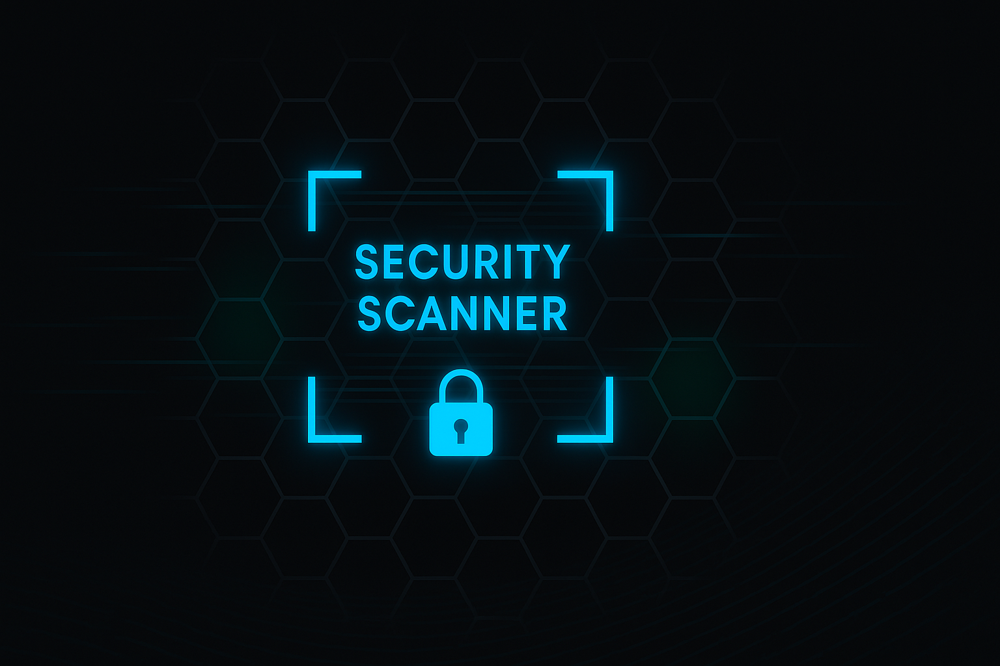

# SimpleSecCheck

<p align="center">
  
</p>

<div align="center">
  
  <p><strong>Single-shot security scanning for code or web apps.</strong></p>
</div>

SimpleSecCheck runs a complete security scan in one command using Docker. No persistent services, no monitoring, just a report.

---

## Why SimpleSecCheck

- **Single-shot**: run once, get an HTML report.
- **Different modes**: codebase, website, network or image scan.
- **Docker-first**: isolated, reproducible scans.
- **WebUI (optional)**: run scans from a minimal UI in dev.

---

## Quick Start (Recommended)

### 0) Clone the repository

```bash
git clone https://github.com/fr4iser90/SimpleSecCheck.git
cd SimpleSecCheck
```

### 1) Start the WebUI (nginx) + Worker in dev

```bash
docker compose --profile dev up --build
```

Open **http://localhost:8080** and start a scan. The WebUI is now **frontend-only** (nginx), and `/api/*` is proxied to the internal worker (backend+scanner).

> **Dev note:** Auto-shutdown is **disabled** in dev for convenience.

### 2) CLI-only scan (optional)

```bash
docker compose --profile dev run --rm scanner
```

### 3) Website scan

```bash
SCAN_TARGET=https://example.com docker compose --profile dev run --rm scanner
```

Results appear in `results/` as a timestamped folder with `security-summary.html`.

---

## Production Mode (Restricted)

Production mode is stricter by design.

```bash
ENVIRONMENT=prod docker compose --profile prod up --build
```

- Docker image scans accept **Docker Hub** images only (`nginx:latest` or `docker.io/...`).
- Intended for controlled environments. Keep **HTTPS** enabled in real deployments.

If you must run production mode locally over HTTP, set:

```bash
FORCE_INSECURE_COOKIES=true
```

---

## Usage Notes

- **Legal**: Scan only systems you own or have explicit permission to test.
- **OWASP cache**: When using Docker Compose, the cache is mounted automatically. For manual `docker run`, mount `scanner/scanners/owasp/data`.
- **CLI detail**: See [CLI & Docker examples](docs/CLI_DOCKER.md) for scan-only commands and full environment variables.

---

## Documentation

- [CLI & Docker examples](docs/CLI_DOCKER.md)
- [WebUI docs](webui/README.md)
- [Development](docs/DEVELOPMENT.md)
- [Tool list](docs/TOOLS.md)
- [Legal considerations](docs/LEGAL_CONSIDERATIONS.md)
- [Third-party licenses](docs/THIRD_PARTY_LICENSES.md)

---

## License

MIT. See [LICENSE](LICENSE).