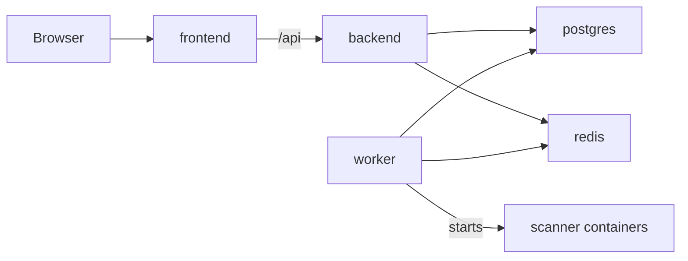

# SimpleSecCheck

<p align="center">
  
</p>

<div align="center">
  
  <p><strong>Single-shot security scanning for code or web apps.</strong></p>
</div>

SimpleSecCheck runs security scans in **Docker**: either as a **standalone scanner** (one-shot CLI) or with the **full platform** (Web UI, API, queue, and database-backed settings).

---

## Architecture (full stack)

Services are **separate containers** with clear roles:

| Component | Role |
|-----------|------|
| **frontend** | nginx — serves the SPA; proxies **`/api/*`** to the backend (not to the worker). |
| **backend** | FastAPI — REST API, WebSockets, auth, business logic, writes to **PostgreSQL**. |
| **worker** | Job runner — consumes **Redis** queue, starts **ephemeral scanner containers** via the Docker socket, shared **`results/`** and **`uploads/`** with the backend. Exposes **:8081** for scanner discovery / worker API (internal to the compose network by default). |
| **scanner** (image) | **Scan engine** — `scanner.core.orchestrator` and plugins (SAST, SCA, DAST, …). In full compose, the `scanner` **service** is a long-lived helper (`sleep infinity`) so you can `exec` in; **one-off scans** run the same image with an explicit **`python3 -m scanner.core.orchestrator`** command (see [CLI_DOCKER.md](docs/CLI_DOCKER.md)). |
| **postgres** | Persistent app data (users, scans, admin config). |
| **redis** | Queue and short-lived job state. |


```mermaid
flowchart LR
  Browser --> frontend
  frontend -->|"/api"| backend
  backend --> postgres
  backend --> redis
  worker --> redis
  worker --> postgres
  worker -->|starts| scanner["scanner containers"]
```

---

## Why SimpleSecCheck

- **Single-shot** (CLI): run once, get an HTML report under `results/`.
- **Different modes**: codebase, website, network or image scan.
- **Docker-first**: isolated, reproducible scans.
- **Web UI (optional)**: queue scans, dashboards, Admin settings.

---

## Quick Start (Recommended)

### 0) Clone the repository

```bash
git clone https://github.com/fr4iser90/SimpleSecCheck.git
cd SimpleSecCheck
```

### 1) Start Frontend (nginx) + Backend + stack

```bash
docker compose up --build
```

Open **http://localhost:80** — nginx serves the UI and proxies **`/api/`** to the **backend** (`backend:8080`). The **worker** runs separately and does not terminate the browser traffic path.

### 2) CLI-only scan (optional, same repo checkout)

The `scanner` service overrides the image command with `sleep infinity`; for a **one-off** scan you must invoke the orchestrator explicitly and set **`SCAN_TARGET`** (or **`SCAN_ID`**) plus **`SCAN_TYPE`** / **`COLLECT_METADATA`** as in [CLI_DOCKER.md](docs/CLI_DOCKER.md). Example — scan the compose-mounted repo at `/project`:

```bash
docker compose run --rm \
  -e SCAN_TYPE=code \
  -e TARGET_TYPE=local_mount \
  -e SCAN_TARGET=/project \
  -e TARGET_PATH_IN_CONTAINER=/project \
  -e COLLECT_METADATA=true \
  scanner python3 -m scanner.core.orchestrator
```

### 3) Website scan (CLI)

```bash
docker compose run --rm \
  -e SCAN_TYPE=website \
  -e TARGET_TYPE=website \
  -e SCAN_TARGET=https://example.com \
  -e COLLECT_METADATA=true \
  scanner python3 -m scanner.core.orchestrator
```

Results appear in `results/` as a timestamped folder with `security-summary.html`.

---

## Deploy behind Traefik

For TLS and a reverse proxy, use the Traefik overlay file (see `docker-compose.traefik.yml` and your `DOMAIN` / labels).

- Docker image scans can be restricted to **Docker Hub** only (`nginx:latest` or `docker.io/...`) via app configuration where applicable.
- Use **HTTPS** on the public edge.

---

## Usage Notes

- **Legal**: Scan only systems you own or have explicit permission to test.
- **OWASP cache**: When using Docker Compose, the cache is mounted automatically. For manual `docker run`, mount `scanner/plugins/owasp/data`.
- **CLI / scanner-only**: [CLI & Docker examples](docs/CLI_DOCKER.md). Extending the engine: [scanner/README.md](scanner/README.md).
- **Configuration** (env, backend settings, Admin): [Configuration](docs/CONFIGURATION.md).
- **Roadmap** (e.g. SonarQube, more tools): [Roadmap](docs/ROADMAP.md).

---

## Documentation

- [Configuration](docs/CONFIGURATION.md) — `.env`, `backend/config/settings.py`, Admin vs scanner env
- [Roadmap](docs/ROADMAP.md) — planned integrations (e.g. SonarQube), platform ideas
- [CLI & Docker examples](docs/CLI_DOCKER.md) — targets, env vars, `docker compose run` / `docker run`
- [Scanner (architecture & plugins)](scanner/README.md) — orchestrator, adding tools, manifests
- [Frontend docs](frontend/README.md)
- [Development](docs/DEVELOPMENT.md)
- [Tool list](docs/TOOLS.md)
- [Legal considerations](docs/LEGAL_CONSIDERATIONS.md)
- [Third-party licenses](docs/THIRD_PARTY_LICENSES.md)

---

## License

MIT. See [LICENSE](LICENSE).
