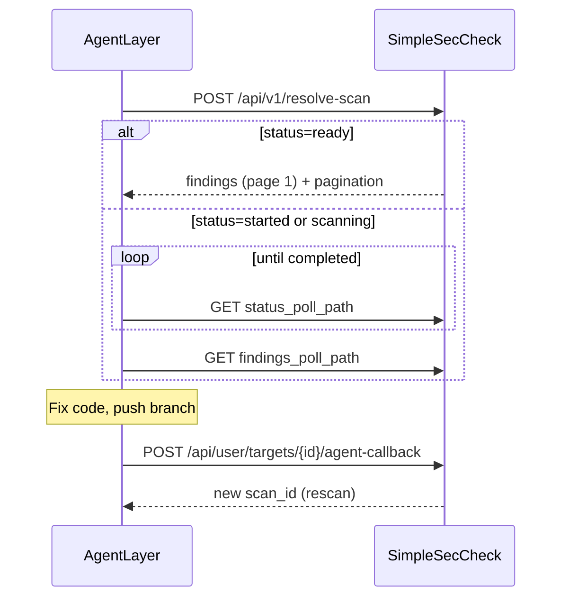

# SimpleSecCheck — Agent & Automation API

Integration guide for **AgentLayer**, CI bots, and other unattended runners that need to:

1. Scan a Git repository (or reuse a fresh scan)
2. Fetch findings as JSON (paginated for small LLM context)
3. Apply fixes externally
4. Trigger a rescan on a feature branch

**Production base URL:** `https://scan.fr4iser.com`  
**Local dev (compose):** `http://localhost:8080`

All paths below are relative to the base URL unless noted.

---

## Authentication

Use an **API key** (recommended for agents). Keys look like:

```text
ssc_<userIdPrefix>_<random>
```

Send on every request:

```http
Authorization: Bearer ssc_xxxxxxxx_...
```

### Create an API key (one-time, in the UI or API)

1. Log in to SimpleSecCheck in the browser.
2. **Settings → API keys → Create**, or:
3. `POST /api/user/api-keys` with a user JWT (not the API key itself):

```bash
curl -sS -X POST "https://scan.fr4iser.com/api/user/api-keys" \
  -H "Authorization: Bearer <user-jwt>" \
  -H "Content-Type: application/json" \
  -d '{"name": "agentlayer-prod", "expires_in_days": 365}'
```

The response field `api_key` is shown **once** — store it in AgentLayer secrets.

| Code | Meaning |
|------|---------|
| `401` | Missing/invalid token |
| `403` | Feature disabled or policy blocked |
| `429` | Rate/concurrency limit (`Retry-After` header may be set) |

Interactive OpenAPI docs (when enabled): `https://scan.fr4iser.com/docs`

---

## Recommended flow (minimal calls)



### Step 1 — Resolve scan + first findings page

`POST /api/v1/resolve-scan` is the main entry point:

- If the latest **completed** scan for this repo/branch matches the current **remote HEAD**, returns findings immediately (`status: ready`).
- If a scan is already running → `status: scanning`.
- Otherwise enqueues a scan → `status: started` (HTTP **202**).

**Request body:**

| Field | Required | Default | Description |
|-------|----------|---------|-------------|
| `repo_url` | yes | — | Git URL (`https://github.com/org/repo` or `git@github.com:org/repo.git`) |
| `branch` | no | target/`main` | Branch to scan |
| `check_commit` | no | `true` | Compare `git ls-remote` HEAD to last scan commit |
| `force_scan` | no | `false` | Always start a new scan |
| `findings_limit` | no | all | Max findings in response (1–200) |
| `findings_offset` | no | `0` | Pagination offset |
| `findings_severity` | no | all | e.g. `CRITICAL,HIGH` |

**Example (small context — first 50 critical/high):**

```bash
BASE="https://scan.fr4iser.com"
KEY="ssc_..."

curl -sS -X POST "$BASE/api/v1/resolve-scan" \
  -H "Authorization: Bearer $KEY" \
  -H "Content-Type: application/json" \
  -d '{
    "repo_url": "https://github.com/org/my-repo",
    "branch": "main",
    "check_commit": true,
    "findings_limit": 50,
    "findings_offset": 0,
    "findings_severity": "CRITICAL,HIGH"
  }'
```

**Response fields (always):**

| Field | Description |
|-------|-------------|
| `status` | `ready` \| `scanning` \| `started` |
| `scan_id` | Active or completed scan ID |
| `repo_url` | Normalized repo URL |
| `branch` | Resolved branch |
| `commit_sha` | Remote or scan commit when known |
| `target_id` | My Targets ID if registered |
| `status_poll_path` | e.g. `/api/v1/scans/{id}/status` |
| `findings_poll_path` | e.g. `/api/v1/scans/{id}/findings?limit=50&offset=0&severity=CRITICAL%2CHIGH` |
| `findings` | Populated when `status=ready` |
| `progress` | 0–100 when scanning |

**HTTP status:**

| status field | HTTP |
|--------------|------|
| `ready`, `scanning` | 200 |
| `started` | 202 |

---

### Step 2 — Poll until scan completes

When `status` is `started` or `scanning`:

```bash
curl -sS "$BASE/api/v1/scans/$SCAN_ID/status" \
  -H "Authorization: Bearer $KEY"
```

Poll every **15–30 s** until `status` is `completed` (or `failed` / `cancelled`).

**Status response (abbreviated):**

```json
{
  "scan_id": "...",
  "status": "running",
  "progress": 42.5,
  "vulnerabilities_found": 0
}
```

---

### Step 3 — Fetch findings (paginated)

Use `findings_poll_path` from the resolve response, or call directly:

```http
GET /api/v1/scans/{scan_id}/findings?limit=50&offset=0&severity=CRITICAL,HIGH
```

| Query | Description |
|-------|-------------|
| `limit` | Page size (1–200). Omit = return all. |
| `offset` | Skip N findings after sort/filter |
| `severity` | Comma-separated: `CRITICAL,HIGH,MEDIUM,LOW,INFO` |

**Sort order (stable for pagination):** severity (CRITICAL first) → `path` → `rule_id` → `line` → `message`.

**Important:** Page 2 must use a **higher offset**, not the same URL twice:

```http
GET .../findings?limit=50&offset=0    → items 0–49
GET .../findings?limit=50&offset=50   → items 50–99 (no duplicates)
```

Or follow `pagination.next_path` from the response.

**Findings response:**

```json
{
  "scan_id": "uuid",
  "status": "completed",
  "generated_at": "2026-05-17T12:00:00Z",
  "source": "file",
  "summary": {
    "total_vulnerabilities": 87,
    "critical_vulnerabilities": 2,
    "high_vulnerabilities": 15,
    "medium_vulnerabilities": 40,
    "low_vulnerabilities": 30,
    "info_vulnerabilities": 0
  },
  "findings": [
    {
      "tool": "semgrep",
      "severity": "HIGH",
      "path": "src/auth.py",
      "line": "42",
      "message": "Use of weak hash...",
      "rule_id": "python.lang.security.weak-hash",
      "cwe": "CWE-327",
      "fix_hint": "Use bcrypt or argon2"
    }
  ],
  "pagination": {
    "total": 17,
    "limit": 50,
    "offset": 0,
    "returned": 17,
    "has_more": false,
    "next_path": null
  }
}
```

| `summary` | Counts for the **whole scan** (not just the page) |
| `pagination.total` | Count after severity filter |
| `pagination.has_more` | More pages available |
| `pagination.next_path` | Relative URL for next page |

**Errors:**

| HTTP | When |
|------|------|
| `409` | Scan still running — retry after status is `completed` |
| `404` | Scan or findings file not found |

---

### Step 4 — Agent fixes code, then rescan branch

After your agent pushes a branch, notify SSC to rescan that branch.

Requires `target_id` from resolve-scan (repo must exist under **My Targets** for this user). If missing, register the repo once via UI or `POST /api/user/targets`.

```bash
curl -sS -X POST "$BASE/api/user/targets/$TARGET_ID/agent-callback" \
  -H "Authorization: Bearer $KEY" \
  -H "Content-Type: application/json" \
  -d '{
    "agent_name": "agentlayer",
    "branch_name": "fix/ssc-critical-20260517",
    "pr_url": "https://github.com/org/my-repo/pull/42",
    "commit_sha": "abc123...",
    "trigger_rescan": true,
    "metadata": {"run_id": "al-12345"}
  }'
```

**Response:**

```json
{
  "target_id": "...",
  "accepted": true,
  "scan_id": "new-scan-uuid",
  "branch_name": "fix/ssc-critical-20260517",
  "message": "Rescan queued"
}
```

Then poll `GET /api/v1/scans/{scan_id}/status` and fetch findings again.

---

## AgentLayer loop (pseudocode)

```text
findings_offset = 0
done = false

while not done:
  if first_run:
    r = POST /api/v1/resolve-scan { repo_url, findings_limit: 50, findings_offset, findings_severity: "CRITICAL,HIGH" }
  else:
    r = GET pagination.next_path   # or rebuild offset manually

  if r.status in (started, scanning):
    wait until GET status_poll_path → completed
    r = GET findings_poll_path

  for each finding in r.findings:
    plan_fix(finding)

  if r.pagination?.has_more:
    findings_offset = r.pagination.offset + r.pagination.returned
    # or GET r.pagination.next_path
  else:
    done = true

apply_fixes_locally()
POST agent-callback { branch_name, trigger_rescan: true }
```

---

## Optional endpoints

| Method | Path | Use |
|--------|------|-----|
| `GET` | `/api/user/targets` | List targets + `last_scan` metadata |
| `GET` | `/api/user/targets/{id}` | Single target |
| `POST` | `/api/user/targets/{id}/scan` | Manual rescan |
| `POST` | `/api/v1/scans/` | Start scan (lower-level than resolve-scan) |
| `GET` | `/api/results/{scan_id}/ai-prompt` | Text prompt for LLM (legacy; prefer JSON findings) |
| `GET` | `/api/health` | Health check (no auth) |

---

## Design notes for integrators

1. **Source of truth:** SSC stores scans and findings; AgentLayer should call the API rather than mirroring full finding history unless you need offline audit.
2. **Context size:** Always use `findings_limit` + `findings_severity`; paginate with `offset` or `next_path`. `summary` tells the agent how much is left.
3. **Commit freshness:** `check_commit: true` avoids stale findings after new pushes to `main`.
4. **Idempotency:** Repeated `resolve-scan` with the same HEAD returns `ready` without a new scan.
5. **Rate limits:** Back off on `429`; respect `Retry-After`.
6. **Not yet available:** Outbound webhook on `scan.completed` (today: poll `status_poll_path`).

---

## Quick reference

```text
Auth:     Authorization: Bearer ssc_...

Primary:  POST /api/v1/resolve-scan
Poll:     GET  /api/v1/scans/{id}/status
Findings: GET  /api/v1/scans/{id}/findings?limit=50&offset=0&severity=CRITICAL,HIGH
Rescan:   POST /api/user/targets/{target_id}/agent-callback
```

---

## Changelog (agent API)

| Version | Changes |
|---------|---------|
| 2026-05 | API key auth (`ssc_`), `GET .../findings`, `POST /api/v1/resolve-scan`, findings pagination (`limit`/`offset`/`severity`) |
