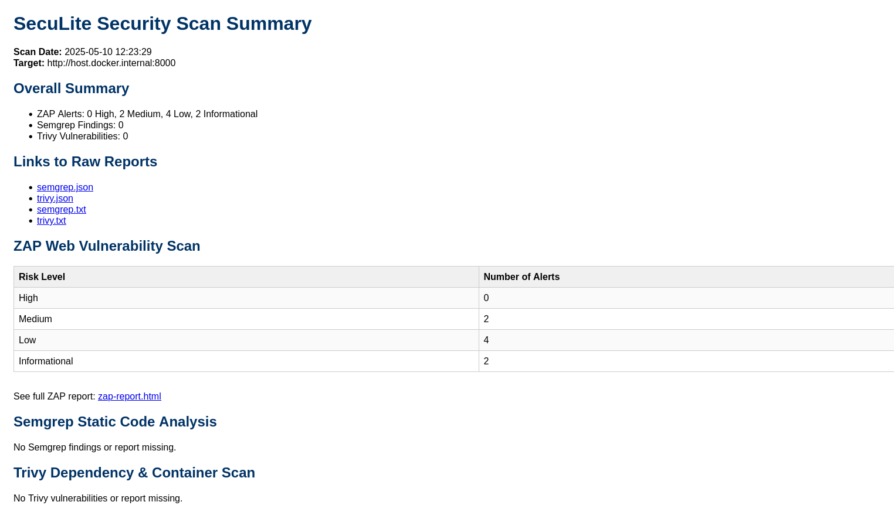

# SecuLite Documentation Hub

Welcome to the central documentation hub for SecuLite. This is the single source of truth for all project documentation.

## 📚 Documentation Structure

```
docs/
├── INDEX.md                # This file (documentation hub)
├── EXTENDING.md            # How to extend/contribute
├── features/               # Feature-specific documentation
│   ├── ai_prompt_injection.md
│   ├── code_issues.md
│   ├── dependency_container.md
│   └── web_vulnerabilities.md
├── plan/                   # Project planning and status
│   ├── PLAN.md            # High-level roadmap
│   ├── STATUS.md          # Current project status
│   ├── detailed_plan.md   # Detailed architecture/design
│   └── task_*.md          # Atomic tasks per phase
├── roles/                 # Role definitions and rules
│   └── README.md          # Role index and relationships
└── screenshots/           # UI/documentation screenshots
```

## 🏗️ Architecture & Design

- [Detailed Architecture](plan/detailed_plan.md)
- [Current Status](plan/STATUS.md)
- [Project Roadmap](plan/PLAN.md)

## 📋 Project Phases & Tasks

### Completed Phases
- [Phase 1: Preparation & Planning](plan/task_1.md)
- [Phase 2: Project Structure](plan/task_2.md)
- [Phase 3: Script Development](plan/task_3.md)
- [Phase 4: Rule & Config Creation](plan/task_4.md)
- [Phase 5: CI/CD Integration](plan/task_5.md)

### Current & Upcoming Phases
- [Phase 6: Automated Analysis & API Security](plan/task_6.md)
- [Phase 7: Advanced Automation](plan/task_7.md)
- [Phase 8: Dashboard Enhancement](plan/task_8.md)
- [Phase 9: LLM Integration](plan/task_9.md)

## 🛡️ Features & Security Checks

- [AI/Prompt Injection Protection](features/ai_prompt_injection.md)
- [Code Issue Detection](features/code_issues.md)
- [Dependency & Container Security](features/dependency_container.md)
- [Web Vulnerability Scanning](features/web_vulnerabilities.md)

## 🧩 Extending & Contributing

- [How to Extend/Contribute](EXTENDING.md)
- [Role & Rule System](roles/README.md)

## 🖼️ Screenshots

Example Security Summary:



## 👤 User vs. Developer Documentation

- **User Documentation:**
  - Quick Start, usage, troubleshooting: see [README.md](../README.md)
  - Feature explanations: see [features/](features/)
- **Developer Documentation:**
  - Contribution, extension, rules: see [EXTENDING.md](EXTENDING.md)
  - Roadmap, tasks, architecture: see [plan/](plan/)
  - Roles and automation: see [roles/](roles/)

## 📖 Documentation Standards

This documentation follows these principles:
1. Single source of truth (this hub)
2. Clear hierarchy and navigation
3. Cross-linked and discoverable
4. Always up-to-date
5. English only

## 🔄 Documentation Updates

The documentation role (`role_documentation.mdc`) ensures:
- All docs are current and cross-linked
- No duplicate information
- Clear navigation structure
- Consistent formatting and style

## 📂 Absolute Paths

- /docs/INDEX.md
- /docs/EXTENDING.md
- /docs/features/
- /docs/plan/
- /docs/roles/
- /docs/screenshots/ 